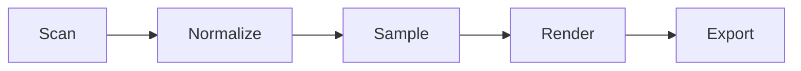

# wifi-analyzer-pc-utility 📡⚡

  

*See the invisible chaos flying through your walls, then actually fix it.*

  

## 🧠 Overview

Here's the thing nobody tells you about Wi-Fi: it's not a "network," it's a shouting match happening in your living room, 24/7, between your router, your neighbor's router, that smart fridge you forgot existed, and a baby monitor from 2015. Most people just reboot the router and pray. We got tired of praying.

**wifi-analyzer-pc-utility** is a native Windows tool built for people who'd rather look at data than light a candle to the router gods. It scans the airwaves around your PC, maps every access point in range, plots channel congestion, tracks signal strength over time, and hands you the kind of diagnostic clarity that ISP support scripts pretend to have but never do. This is a WiFi analyzer PC utility built for the actual problem — not a marketing dashboard with a smiley face when everything's "fine."

Who's this for? Home users chasing dead zones, gamers who blame lag on everything except the actual RF environment, IT folks doing informal site surveys without hauling out enterprise gear, and apartment dwellers stuck in a building where every unit has three routers each. If you've ever squinted at a signal bar wondering what it actually means — this is your tool.

> [!NOTE]
> This tool reads Wi-Fi signal and network metadata already broadcast by nearby access points. It does not access, decrypt, or interfere with any network traffic. It's an analyzer, not a lockpick.

---

## 🚀 What It Actually Does

We built this as a **table**, not a wall of bullet points, because your Wi-Fi problems aren't a checklist — they're a system, and each piece talks to the others.

| Capability | The Real-World Angle |
|---|---|
| **Live Channel Mapper** | Watch every 2.4GHz and 5GHz/6GHz channel in your area light up in real time — see exactly who's squatting on channel 6 and ruining your evening. |
| **Signal Strength Timeline** | Graphs RSSI over minutes or hours, so "my Wi-Fi feels bad" becomes "my Wi-Fi drops 20dBm every time the microwave runs." |
| **Access Point Inventory** | Lists every visible AP with SSID, BSSID, vendor, security type, and channel width — your neighborhood's entire wireless census in one table. |
| **Congestion Heatmap** | A visual "where does everyone's traffic pile up" view, so you can pick a channel nobody else thought of. |
| **Roaming & Drop Detective** | Flags disconnects, re-authentications, and roaming events between APs — perfect for chasing that mystery lag spike. |
| **Band Steering Insight** | Shows whether your device is actually using 5GHz/6GHz or quietly falling back to crowded 2.4GHz. |
| **Export & Snapshot Reports** | One click exports a session as CSV/JSON — hand it to your ISP's support line and watch them be mildly impressed. |
| **Historical Session Replay** | Reopen a past scan and scrub through it like a DVR for your router's worst day. |

> [!TIP]
> Run a scan right before and right after moving your router. The before/after comparison is oddly satisfying — like a home makeover show, but for radio waves.

---

## 🏁 Getting Off the Ground

No installers to babysit, no dependency soup, no "please restart 4 times." Here's the whole ritual:

1. **Visit the landing page** — click the big purple button above (or below, we're generous).

2. **Download the standalone executable** — it's self-contained, no separate runtime needed.

3. **Run it** — Windows may show a SmartScreen prompt for unsigned/new tools; click "More info → Run anyway."

4. **Hit Scan** — the moment you open it, it starts sniffing out nearby wireless activity. That's it.

> [!IMPORTANT]
> Some laptops require the Wi-Fi adapter to support monitor-style querying for full channel detail. If certain fields show as "N/A," it's almost always a driver limitation, not a bug in the tool.

---

## 🖥️ System Requirements

<strong>Click to expand — the boring but important bit</strong>

| Requirement | Detail |
|---|---|
| OS | Windows 10 (64-bit) or Windows 11 |
| Architecture | x64 |
| Dependencies | None — fully standalone, no runtime installs |
| Wi-Fi Adapter | Any adapter with driver-level scan support (nearly all built-in laptop cards qualify) |
| Disk Space | Under 50MB |
| Admin Rights | Not required for basic scanning; some deep-diagnostic features may prompt for elevation |

  

---

## ⚙️ How It Works

Under the hood, this isn't magic — it's just a disciplined pipeline that most people never bother building:

1. The app queries the OS wireless interface for visible networks and signal telemetry.

2. Raw scan data gets normalized — vendor OUIs resolved, channel widths decoded, security flags parsed.

3. A sampling loop re-polls at a fixed interval to build the live timeline instead of a single frozen snapshot.

4. Everything renders into the dashboard — tables, graphs, and the congestion view — in real time.

5. On request, the session gets serialized into an exportable report.

---

## 🩹 Troubleshooting

**Q: The app shows zero access points, even though my phone sees Wi-Fi fine.**
A: Check that your Wi-Fi adapter is enabled (not in Airplane Mode) and that its driver isn't in a "power-saving sleep" state — some laptops aggressively suspend the radio.

**Q: Signal strength numbers look weirdly stable, like too stable.**
A: Windows caches scan results briefly at the OS level. Give it 10-15 seconds between manual rescans for fresh data.

**Q: 6GHz networks aren't showing up at all.**
A: Your adapter needs Wi-Fi 6E/7 hardware support. If it's an older card, 6GHz simply isn't visible to the OS — this is a hardware ceiling, not a software one.

**Q: Export button greyed out?**
A: You need at least one completed scan cycle before a session becomes exportable — mid-scan exports are intentionally blocked to avoid partial garbage data.

**Q: Why does my own router show a weaker signal than my neighbor's?**
A: Distance, wall material, and interference sources (metal studs, mirrors, microwaves) matter more than raw router wattage. Physics doesn't care about brand names.

**Q: The app won't launch — SmartScreen blocked it.**
A: This is standard behavior for smaller independent tools without an expensive code-signing certificate. Click "More info → Run anyway" from the official download.

---

## 🎨 UI, UX & Little Details

> [!TIP]
> The interface leans dark by default because staring at a bright white dashboard while debugging Wi-Fi at 1am is a special kind of self-harm.

- **Themes:** Dark (default), Light, and a "High Contrast" mode for accessibility.

- **Keyboard Shortcuts:**

  | Shortcut | Action |
  |---|---|
  | `Ctrl + R` | Force rescan |
  | `Ctrl + E` | Export session |
  | `Ctrl + F` | Filter AP list |
  | `Ctrl + ,` | Open settings |
  | `Esc` | Close active panel |

- **Settings:** Adjustable scan interval, unit preference (dBm vs percentage), and channel-width color coding.

- **Layout:** Resizable panels — drag the congestion heatmap and signal timeline side-by-side or stack them, your call.

---

## 🤝 Contributing & Community

This project grew out of pure Wi-Fi frustration, and it stays alive because people keep filing sharp, specific issues instead of vague ones. If you find a bug, include your adapter model and driver version — it saves everyone a week of back-and-forth.

- Open an issue for bugs or feature requests.

- Submit a pull request if you've got a fix — small, focused PRs get reviewed faster than sprawling ones.

- Discussions are welcome for "is this expected behavior" type questions.

> [!WARNING]
> Please don't file issues asking how to access networks you don't own or administer. This tool analyzes signal and metadata already broadcast publicly — it is not, and will never be, a tool for unauthorized network access.

---

## 📜 License

Released under the [MIT License](LICENSE), 2026. Use it, fork it, build weird things on top of it — just keep the license notice intact.

---

## ⚠️ Disclaimer

This software is provided "as is," without warranty of any kind. It is intended strictly for analyzing and diagnosing wireless networks that you own or have explicit permission to assess. The maintainers are not responsible for misuse, misconfiguration, or any decisions made based on the data this tool presents — it's a diagnostic aid, not a substitute for professional network engineering.

